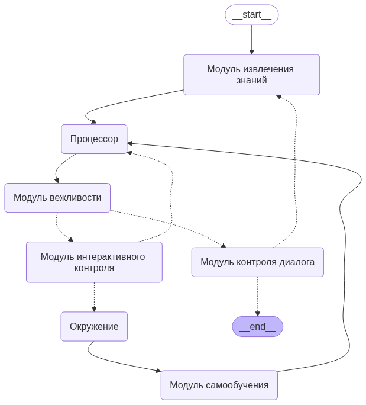

# SUSU AGI

A small LLM powerd demo of autonomous agents capabilities.

## Key Features

To be filled...

## Usage

1. When the agent is asking you to review it's tool call you can do the following:
- just leave the feedback field empty to let the agent continue
- give your feedback using natural language to correct the agent's action

2. To quit the dialog you need to type ':q' or 'quit' when agent is wating for your next question.

## Agent's [Cognitive Architecture](https://blog.langchain.dev/what-is-a-cognitive-architecture/)


## Installation guide

1. Create virtual environment using pyenv
```bash
pyenv exec python -m venv venv
source venv/bin/activate
```
2. Install project's dependencies
```bash
pip install -r requirements.txt
```
3. Configure your environment (you'll need a [ProxyAPI](https://proxyapi.ru) token for this)
```bash
export OPENAI_API_KEY=<your_proxyapi_token>
```
4. Experience AGI's capabilities
```bash
python main.py
```
